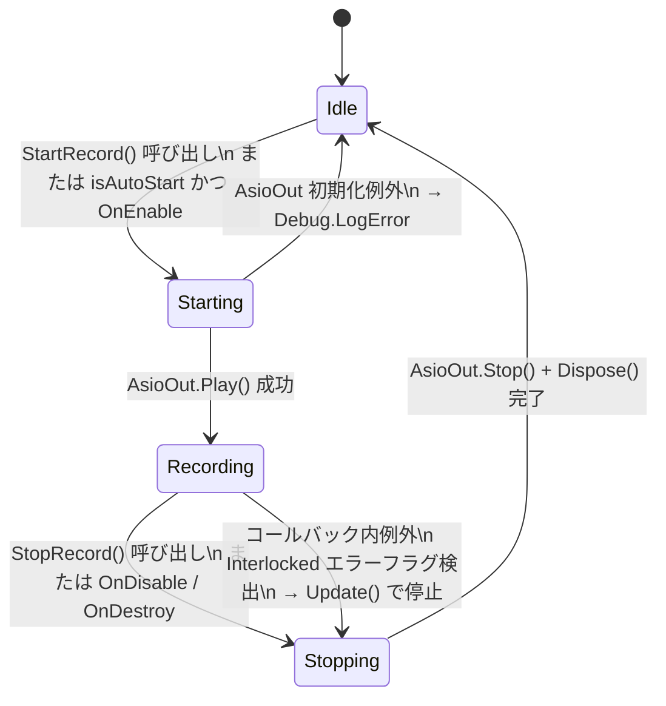
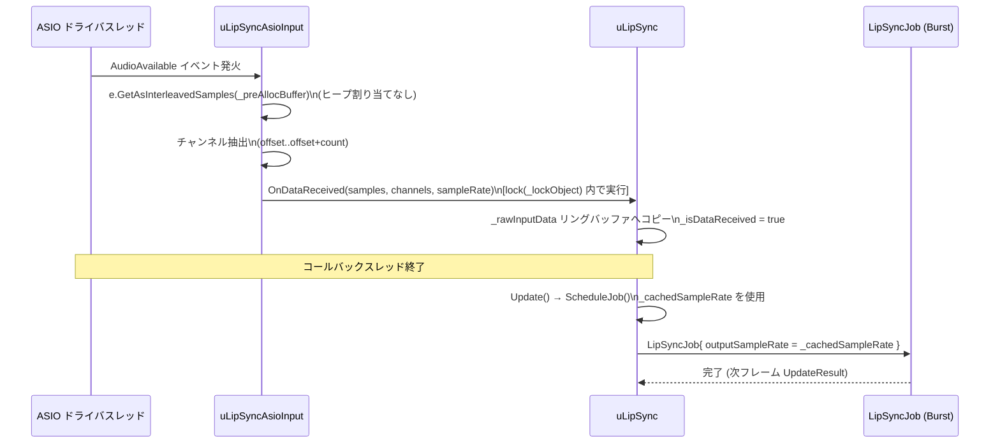

# 設計ドキュメント: asio-input-support

---

## 概要

本機能は、hecomi/uLipSync（`com.hecomi.ulipsync` v3.1.5）のフォークに対して、NAudio 2.x（`NAudio.Core.dll` + `NAudio.Asio.dll`）を利用した ASIO オーディオ入力サポートを追加する。主な対象ユーザーは Windows 上で活動する VTuber であり、既存の `UnityEngine.Microphone` API よりも低レイテンシかつ高品質なオーディオキャプチャを必要としている。

設計の核心は次の 3 点である。第一に、新コンポーネント `uLipSyncAsioInput` を追加して ASIO デバイスのライフサイクルと RT 安全なバッファ管理を担わせる。第二に、`IAudioInputSource` インターフェースを導入して `uLipSyncMicrophone`（リファクタ）と `uLipSyncAsioInput` を共通の契約で抽象化し、EditMode テストでのモック差し替えを可能にする。第三に、`uLipSync.OnDataReceived` のシグネチャを `(float[], int, int)` に拡張してサンプルレートをパイプラインに正確に伝播させる（破壊的変更）。

本仕様は Unity 6000.3.10f1、スクリプティングバックエンド Mono、Windows x86_64 Standalone のみを対象とする。IL2CPP および非 Windows プラットフォームは明示的に非対応である。

### Goals

- ASIO デバイスの列挙・選択・録音ライフサイクルを管理する `uLipSyncAsioInput` コンポーネントを提供する
- ASIO コールバックから既存の MFCC 解析パイプライン（`LipSyncJob`）へ低レイテンシでサンプルを供給する
- `IAudioInputSource` 抽象により EditMode テストで実機ハードウェアなしに品質検証できる構造にする
- 非 Windows ビルドおよび IL2CPP ビルドでコンパイルエラーを発生させない

### Non-Goals

- ASIO ドライバ自体のインストール補助・ASIO コントロールパネルの操作
- MIDI / タイムコード処理
- macOS / Linux / WebGL / iOS / Android 対応
- IL2CPP スクリプティングバックエンドへの対応
- 上流リポジトリ（hecomi/uLipSync）との自動マージ調整

---

## Boundary Commitments

### This Spec Owns

- `IAudioInputSource` インターフェース定義（`StartRecord()`、`StopRecord()`、`isRecording`）
- `uLipSyncAsioInput` コンポーネントの全実装（デバイス列挙、ライフサイクル、バッファ管理、エラーハンドリング、エディタ UI）
- `uLipSync.OnDataReceived` のシグネチャ変更（`(float[], int)` → `(float[], int, int)`）と `ScheduleJob` 内サンプルレート補正
- `uLipSyncMicrophone` への `IAudioInputSource` 実装付与（既存 API 非破壊）
- `uLipSyncBakedDataPlayer`・`uLipSyncCalibrationAudioPlayer` の `OnDataReceived` 呼び出し書き換え
- NAudio 2.x + 依存 DLL の `Assets/uLipSync/Plugins/` 配置とプラグインインポート設定
- `Assets/uLipSync/Runtime/uLipSync.Runtime.asmdef` への precompiled 参照追加
- `IAudioInputSource` モックを用いた EditMode テスト設計

### Out of Boundary

- `LipSyncJob` の内部アルゴリズム変更（`outputSampleRate` フィールドは既存のまま使用する）
- `uLipSyncAudioSource`・WebGL パス・Timeline・Bake ワークフローの機能変更（`OnDataReceived` シグネチャ更新のみ）
- ASIO ドライバの Windows レジストリ操作・インストール
- 手動テストプラン（`test-plan.md`）の本文（実装フェーズで別途作成）

### Allowed Dependencies

- Unity 6000.3.10f1 組み込み API（`UnityEngine.Microphone`、`AudioSettings`、`Debug`、`MonoBehaviour` ライフサイクル）
- Burst Compiler（`com.unity.burst` 1.6.6、既存）・Unity Mathematics（`com.unity.mathematics` 1.2.6、既存）
- NAudio 2.x（`NAudio.Core.dll`、`NAudio.Asio.dll`）— MIT ライセンス
- `System.Threading.Interlocked`（`mscorlib`、Mono 組み込み）

### Revalidation Triggers

- `LipSyncJob.outputSampleRate` フィールド名・型の変更
- NAudio 2.x の `AsioAudioAvailableEventArgs.GetAsInterleavedSamples` シグネチャ変更
- `uLipSync._lockObject` の可視性・型の変更
- Unity 6000.3.x 以降のオーディオスレッドモデル変更

---

## アーキテクチャ

### 既存アーキテクチャの分析

現在の uLipSync パイプラインは以下の流れで動作する。

1. `OnAudioFilterRead(float[], int)` — Unity オーディオスレッドから呼び出される（または `uLipSyncAudioSource` プロキシ経由）
2. `uLipSync.OnDataReceived(float[], int)` — `_lockObject` でリングバッファ `_rawInputData` にコピー
3. `uLipSync.Update()` → `ScheduleJob()` — `LipSyncJob`（Burst）をスケジュール。`outputSampleRate = AudioSettings.outputSampleRate` を固定使用
4. `LipSyncJob.Execute()` — MFCC 計算・フォネーム判定

**変更ポイント**:
- `OnDataReceived` はサンプルレートを受け取れない（ASIO デバイスのサンプルレートが Unity のデフォルトと異なる場合に誤差が生じる）
- `AudioSettings.outputSampleRate` を `ScheduleJob` で固定参照しているため ASIO パスでは不正確になる
- `uLipSyncMicrophone` は単独の MonoBehaviour で、テスト用の共通インターフェースがない
- `uLipSyncBakedDataPlayer` の `UpdateCallback()` は `OnDataReceived` を直接呼ばない（BakedData ベース）。ただし `OnBakeUpdate` は `OnDataReceived(float[], int)` を使用
- `uLipSyncCalibrationAudioPlayer` は `OnDataReceived` を直接呼ばない。`OnAudioRead` コールバック経由で `OnAudioFilterRead` に渡される

### アーキテクチャパターン・バウンダリマップ

採用パターン: **ポート＆アダプタ（限定）** — `IAudioInputSource` がポートとなり、`uLipSyncMicrophone`（リファクタ）と `uLipSyncAsioInput`（新規）がアダプタとなる。コアパイプライン（`uLipSync` + `LipSyncJob`）は変更を最小化する。

```mermaid
graph TB
    subgraph InputAdapters
        Mic[uLipSyncMicrophone\nIAudioInputSource 実装]
        Asio[uLipSyncAsioInput\nIAudioInputSource 実装]
    end

    subgraph PluginLayer
        NAudioCore[NAudio.Core.dll]
        NAudioAsio[NAudio.Asio.dll]
        SysMemory[System.Memory.dll\nSystem.Buffers.dll\nSystem.Numerics.Vectors.dll\nSystem.Runtime.CompilerServices.Unsafe.dll]
    end

    subgraph CorePipeline
        uLS[uLipSync\nMonoBehaviour]
        Job[LipSyncJob\nBurst IJob]
    end

    subgraph EditorLayer
        Ed[uLipSyncAsioInputEditor\nCustomEditor]
    end

    IAI[IAudioInputSource\nインターフェース]

    Mic -->|implements| IAI
    Asio -->|implements| IAI
    Asio -->|uses| NAudioAsio
    NAudioAsio -->|depends on| NAudioCore
    NAudioCore -->|depends on| SysMemory
    Asio -->|OnDataReceived\nfloat[] samples, int channels, int sampleRate| uLS
    Mic -->|OnDataReceived\nfloat[] samples, int channels, int sampleRate| uLS
    uLS -->|Schedule| Job
    Ed -->|edits| Asio
```

**依存方向**: PluginLayer → InputAdapters → CorePipeline。CorePipeline は InputAdapters を知らない（`OnDataReceived` メソッドを公開するのみ）。

### テクノロジースタック

| レイヤ | 選択 / バージョン | 本機能での役割 | 備考 |
|-------|-----------------|--------------|------|
| オーディオ入力（新規） | NAudio 2.x（NAudio.Core + NAudio.Asio） | ASIO ドライバ列挙・録音・サンプル取得 | MIT ライセンス。Windows x86_64 専用 |
| 依存 DLL（新規） | System.Memory 等 4 本 | NAudio が必要とする .NET API | Unity Mono の Facades 不在問題の回避 |
| スクリプティングバックエンド | Mono（Unity 6000.3.10f1） | 唯一のサポート対象 | IL2CPP 非対応 |
| 既存 DSP | Burst 1.6.6 + Mathematics 1.2.6 | LipSyncJob（変更なし） | outputSampleRate フィールドのみ変更 |
| テスト | Unity Test Framework 1.1.33（既存） | EditMode テスト | IAudioInputSource モック使用 |

---

## ファイル構造計画

### 新規追加ファイル

```
Assets/uLipSync/
├── Runtime/
│   ├── IAudioInputSource.cs              # 共通インターフェース定義
│   └── uLipSyncAsioInput.cs              # ASIO 入力コンポーネント本体
├── Editor/
│   └── uLipSyncAsioInputEditor.cs        # ASIO 専用 CustomEditor
└── Plugins/
    ├── NAudio-LICENSE.txt                # NAudio MIT ライセンス通知（必須）
    ├── NAudio.Core.dll                   # NAudio コア（Windows x86_64）
    ├── NAudio.Asio.dll                   # ASIO ドライババインディング（Windows x86_64）
    ├── System.Memory.dll                 # Span<T>/Memory<T>（Windows x86_64）
    ├── System.Buffers.dll                # ArrayPool<T>（Windows x86_64）
    ├── System.Numerics.Vectors.dll       # SIMD 型（Windows x86_64）
    └── System.Runtime.CompilerServices.Unsafe.dll  # unsafe 操作（Windows x86_64）
```

> 注: 現行の `Assets/uLipSync/Plugins/` は存在しない場合、新規作成する。DLL はすべて同一ディレクトリに配置し、Plugin Importer で Windows x86_64 専用に設定する。

### 変更ファイル

- `Assets/uLipSync/Runtime/Core/Common.cs` — `AudioFilterReadEvent` の型を `UnityEvent<float[], int>` → `UnityEvent<float[], int, int>` に変更（CI-1 対応）
- `Assets/uLipSync/Runtime/uLipSyncAudioSource.cs` — `onAudioFilterRead.Invoke(data, channels)` 呼び出し箇所に `AudioSettings.outputSampleRate` を第 3 引数として追加（CI-1 対応）
- `Assets/uLipSync/Runtime/uLipSync.cs` — `OnDataReceived` シグネチャ変更、`ScheduleJob` のサンプルレート補正
- `Assets/uLipSync/Runtime/uLipSyncMicrophone.cs` — `IAudioInputSource` 実装付与
- `Assets/uLipSync/Runtime/uLipSyncBakedDataPlayer.cs` — `OnBakeUpdate`（Editor のみ）の `OnDataReceived` 呼び出し書き換え（※後述の呼び出し元分析参照）
- `Assets/uLipSync/Runtime/uLipSyncCalibrationAudioPlayer.cs` — 直接呼び出しなし（詳細後述）
- `Assets/uLipSync/Runtime/uLipSync.Runtime.asmdef` — `precompiledReferences` に NAudio DLL 名を追加

---

## システムフロー

### ASIO 録音ライフサイクル（状態遷移）



### ASIO コールバック → パイプライン供給フロー



**フロー上の重要な決定**:
- `OnDataReceived` の `sampleRate` は `_cachedSampleRate` フィールドに保存し、メインスレッドの `ScheduleJob` で参照する
- コールバックスレッドとメインスレッドの同期は `_lockObject` の lock のみ（追加の同期プリミティブなし）
- エラーフラグは `Interlocked.Exchange(ref _errorFlag, 1)` でセット、`Update()` で `Interlocked.Exchange(ref _errorFlag, 0)` で読み取り後クリア

---

## 要件トレーサビリティ

| 要件 | サマリー | コンポーネント | インターフェース | フロー |
|------|---------|-------------|--------------|------|
| 1.1 | GetDriverNames() 呼び出し | uLipSyncAsioInput | `string[] GetAsioDriverNames()` | — |
| 1.2 | 先頭デバイスをデフォルト選択 | uLipSyncAsioInput | `selectedDeviceIndex` フィールド | — |
| 1.3 | ドライバなし警告 | uLipSyncAsioInputEditor | HelpBox 表示 | — |
| 1.4 | プラットフォームガード | uLipSyncAsioInput | `#if` ガード | — |
| 1.5 | 非 Windows での例外キャッチ | uLipSyncAsioInput | try-catch 内 GetDriverNames | — |
| 2.1 | StartRecord() で AsioOut 初期化 | uLipSyncAsioInput | `IAudioInputSource.StartRecord()` | ライフサイクル状態遷移 |
| 2.2 | StopRecord() で Stop + Dispose | uLipSyncAsioInput | `IAudioInputSource.StopRecord()` | ライフサイクル状態遷移 |
| 2.3 | isRecording プロパティ | uLipSyncAsioInput | `IAudioInputSource.isRecording` | — |
| 2.4 | OnDisable / OnDestroy 自動停止 | uLipSyncAsioInput | MonoBehaviour ライフサイクル | — |
| 2.5 | isAutoStart による自動起動 | uLipSyncAsioInput | `isAutoStart` フィールド | — |
| 2.6 | 初期化失敗時のエラーログ | uLipSyncAsioInput | try-catch + Debug.LogError | ライフサイクル状態遷移 |
| 2.7 | 再起動時の旧インスタンス破棄確認 | uLipSyncAsioInput | StartRecord() 実装 | — |
| 3.1 | inputChannelOffset / Count 公開 | uLipSyncAsioInput | インスペクタフィールド | — |
| 3.2 | 8192×32 プリアロケートバッファ | uLipSyncAsioInput | `_preAllocBuffer` フィールド | コールバックフロー |
| 3.3 | インターリーブサンプル書き込み | uLipSyncAsioInput | GetAsInterleavedSamples(buffer) | コールバックフロー |
| 3.4 | ASIO サンプルレートを引数として渡す | uLipSyncAsioInput | OnDataReceived(samples, ch, sr) | コールバックフロー |
| 3.5 | ScheduleJob でサンプルレート補正 | uLipSync | `_cachedSampleRate` 使用 | コールバックフロー |
| 3.6 | チャンネル超過クランプ + 警告 | uLipSyncAsioInput | StartRecord() 内検証 | — |
| 4.1 | 直接コールバックからのデータ供給 | uLipSyncAsioInput | OnDataReceived 直接呼び出し | コールバックフロー |
| 4.2 | _lockObject 再利用 | uLipSyncAsioInput + uLipSync | lock(_lockObject) | コールバックフロー |
| 4.3 | コールバック内 Unity API 禁止 | uLipSyncAsioInput | 設計制約 | — |
| 4.4 | Interlocked エラーフラグ | uLipSyncAsioInput | `_errorFlag` + Interlocked | コールバックフロー |
| 4.5 | lipSync フィールド参照 | uLipSyncAsioInput | `[SerializeField]` uLipSync lipSync | — |
| 4.6 | lipSync null 時のスキップ | uLipSyncAsioInput | Update() で警告 | — |
| 5.1 | 初期化例外キャッチ + LogError | uLipSyncAsioInput | try-catch | ライフサイクル状態遷移 |
| 5.2 | デバイスビジー時メッセージ | uLipSyncAsioInput | 例外メッセージ判定 + LogError | — |
| 5.3 | コールバック例外でエラーフラグ + 停止 | uLipSyncAsioInput | Interlocked + Update() | コールバックフロー |
| 5.4 | Dispose 保証 | uLipSyncAsioInput | try-finally | ライフサイクル状態遷移 |
| 6.1 | ASIO コード全体を #if ガード | uLipSyncAsioInput | プリプロセッサ | — |
| 6.2 | 非 Windows コンパイルエラーなし | uLipSyncAsioInput | スタブ実装 | — |
| 6.3 | DLL 配置 | Plugins/ ディレクトリ | — | — |
| 6.4 | Plugin Importer 設定 | DLL メタデータ | — | — |
| 6.5 | NAudio-LICENSE.txt 同梱 | Plugins/ ディレクトリ | — | — |
| 6.6 | Mono 専用・IL2CPP 非対応の明記 | README | — | — |
| 7.1 | 旧シグネチャ削除・新シグネチャのみ | uLipSync | `OnDataReceived(float[], int, int)` | — |
| 7.2 | OnAudioFilterRead の書き換え（AudioFilterReadEvent 型変更含む） | uLipSync + uLipSyncAudioSource + Common.cs | AudioSettings.outputSampleRate を渡す / AudioFilterReadEvent 型変更 | CI-1 対応: OK（「AudioFilterReadEvent 連鎖変更」参照） |
| 7.3 | uLipSyncBakedDataPlayer 書き換え | uLipSyncBakedDataPlayer | OnBakeUpdate | — |
| 7.4 | uLipSyncCalibrationAudioPlayer 書き換え | uLipSyncCalibrationAudioPlayer | 後述参照 | — |
| 7.5 | ScheduleJob でサンプルレート使用 | uLipSync | _cachedSampleRate | — |
| 7.6 | ASIO パスで新シグネチャ使用 | uLipSyncAsioInput | OnDataReceived(samples, ch, sr) | — |
| 8.1 | IAudioInputSource 定義と実装 | IAudioInputSource | インターフェース | — |
| 8.2 | StartRecord/StopRecord/isRecording | IAudioInputSource | インターフェース | — |
| 8.3 | モックで EditMode テスト可能 | MockAudioInputSource | テスト設計 | — |
| 8.4 | uLipSyncMicrophone の既存 API 非破壊 | uLipSyncMicrophone | インターフェース追加のみ | — |
| 9.1 | ステータス表示 | uLipSyncAsioInputEditor | 読み取り専用フィールド | — |
| 9.2 | デバイス更新ボタン | uLipSyncAsioInputEditor | Button + GetDriverNames | — |
| 9.3 | CustomEditor + 非 Windows HelpBox | uLipSyncAsioInputEditor | #if + HelpBox | — |
| 9.4 | Start/Stop ボタン（isAutoStart=false 時） | uLipSyncAsioInputEditor | 再生中のみ表示 | — |
| 9.5 | 非 Windows でも null 参照なし | uLipSyncAsioInputEditor | 防御的描画 | — |
| 10.1 | test-plan.md（後で作成） | — | — | — |
| 10.2 | IAudioInputSource モック EditMode テスト | MockAudioInputSource + Tests | EditMode テスト | — |
| 10.3 | OnDataReceived 引数検証テスト | Tests | EditMode テスト | — |
| 10.4 | Unity API 禁止の構造的検証 | MockAudioInputSource | 設計制約 | — |
| 10.5 | 実機テスト（test-plan.md 参照） | — | — | — |

---

## コンポーネントとインターフェース

### コンポーネントサマリー表

| コンポーネント | レイヤ | 概要 | 要件カバレッジ | 主要依存（P0/P1） | 契約 |
|-------------|-------|------|-------------|----------------|------|
| IAudioInputSource | 抽象インターフェース | オーディオ入力源の共通契約 | 8.1, 8.2 | — | Service |
| uLipSyncAsioInput | Runtime | ASIO デバイス管理・サンプル供給 | 1, 2, 3, 4, 5, 6 | IAudioInputSource (P0), uLipSync (P0), NAudio (P0) | Service, State |
| uLipSync（修正） | Runtime | パイプラインエントリ・サンプルレート補正 | 3.5, 7.1, 7.2, 7.5 | LipSyncJob (P0) | Service |
| uLipSyncMicrophone（リファクタ） | Runtime | 既存 Microphone パス | 8.4 | IAudioInputSource (P0) | Service |
| uLipSyncBakedDataPlayer（修正） | Runtime | Bake データ再生・OnBakeUpdate 書き換え | 7.3 | uLipSync (P0) | — |
| uLipSyncCalibrationAudioPlayer（修正） | Runtime | キャリブレーション音声再生 | 7.4 | uLipSync (P0) | — |
| uLipSyncAsioInputEditor | Editor | ASIO 専用インスペクタ UI | 9.1〜9.5 | uLipSyncAsioInput (P0) | — |
| MockAudioInputSource | Tests | テスト用モック実装 | 8.3, 10.2〜10.4 | IAudioInputSource (P0) | — |

---

### 抽象インターフェース層

#### IAudioInputSource

| フィールド | 詳細 |
|----------|------|
| Intent | オーディオ入力源（Microphone / ASIO）の共通ライフサイクル契約を定義する |
| Requirements | 8.1, 8.2, 8.3, 8.4 |

**Responsibilities & Constraints**
- `StartRecord()`・`StopRecord()`・`isRecording` の最小サーフェスを規定する
- MonoBehaviour の実装を強制せず、モック実装（pure C# クラス）でも実装できる

**Contracts**: Service [x]

##### Service Interface

```csharp
namespace uLipSync
{
    /// <summary>
    /// オーディオ入力源の共通インターフェース。
    /// uLipSyncMicrophone と uLipSyncAsioInput の両クラスが実装する。
    /// EditMode テストでのモック差し替えを可能にする。
    /// </summary>
    public interface IAudioInputSource
    {
        /// <summary>録音が進行中かどうかを示す。</summary>
        bool isRecording { get; }

        /// <summary>録音を開始する。</summary>
        void StartRecord();

        /// <summary>録音を停止してリソースを解放する。</summary>
        void StopRecord();
    }
}
```

- 事前条件: `StartRecord()` 呼び出し前にデバイスが選択・初期化されていること
- 事後条件: `StopRecord()` 後、`isRecording` は `false` になること
- 不変条件: `isRecording == true` の間、デバイスリソースが確保されていること

---

### Runtime 層

#### uLipSyncAsioInput

| フィールド | 詳細 |
|----------|------|
| Intent | ASIO デバイスのライフサイクル管理、RT 安全なサンプル供給、エラー状態の Interlocked ハンドシェイクを担う |
| Requirements | 1.1〜1.5, 2.1〜2.7, 3.1〜3.6, 4.1〜4.6, 5.1〜5.4, 6.1〜6.2 |

**Responsibilities & Constraints**
- 唯一の `AsioOut` インスタンス保持者。ライフサイクル（init → start → callback → stop → dispose）を管理する
- `_preAllocBuffer = new float[8192 * 32]` を Awake 時に確保し、コールバック内でのヒープ割り当てを行わない
- ASIO コールバック（非 Unity スレッド）内では Unity API を呼び出さない
- `uLipSync._lockObject` を `lock` に使用する（新規ロック導入なし）
- `#if UNITY_STANDALONE_WIN || UNITY_EDITOR` 外ではすべて空スタブとなる

**Dependencies**
- Inbound: Unity MonoBehaviour ライフサイクル（OnEnable / OnDisable / OnDestroy / Update）(P0)
- Outbound: `uLipSync.OnDataReceived(float[], int, int)` — サンプル供給 (P0)
- External: `NAudio.Asio.AsioOut` — ASIO ドライババインディング (P0)

**Contracts**: Service [x], State [x]

##### パブリックインスペクタフィールド

```csharp
// uLipSyncAsioInput の SerializeField フィールド（抜粋）
[SerializeField] uLipSync lipSync;           // 供給先パイプライン（必須）
[SerializeField] int selectedDeviceIndex = 0; // 選択デバイスインデックス
[SerializeField] int inputChannelOffset = 0;  // 入力チャンネルオフセット（デフォルト 0）
[SerializeField] int inputChannelCount = 1;   // 入力チャンネル数（デフォルト 1）
[SerializeField] bool isAutoStart = true;     // OnEnable 時の自動録音開始
```

##### 主要プロパティ（読み取り専用）

```csharp
public bool isRecording { get; private set; }
public string selectedDeviceName { get; private set; }
public int lastCallbackSampleCount { get; private set; }  // エディタ表示用
```

##### Service Interface

```csharp
// IAudioInputSource 実装
public void StartRecord();
public void StopRecord();

// デバイス管理
public string[] GetAsioDriverNames();   // #if ガード内。非 Windows では空配列を返す

// 内部メソッド（private）
private void OnAsioAudioAvailable(object sender, AsioAudioAvailableEventArgs e);
private void HandleErrorFlag();         // Update() から呼ばれる
```

##### ASIO コールバック擬似コード

```
// ASIO ドライバスレッドで実行される
private void OnAsioAudioAvailable(object sender, AsioAudioAvailableEventArgs e)
{
    // Unity API 呼び出し禁止

    try
    {
        int totalSamples = e.SamplesPerBuffer * e.InputBuffers.Length;
        if (totalSamples > _preAllocBuffer.Length)
        {
            // バッファオーバーフロー：エラーフラグをセットして即時リターン
            Interlocked.Exchange(ref _errorFlag, ErrorCode.BufferOverflow);
            return;
        }

        // 事前確保バッファにインターリーブサンプルを書き込む（ヒープ割り当てなし）
        e.GetAsInterleavedSamples(_preAllocBuffer);

        // チャンネル抽出（offset〜offset+count）は OnDataReceived 内で実施
        lipSync.OnDataReceived(_preAllocBuffer, inputChannelCount, _cachedSampleRate);
    }
    catch (Exception)
    {
        // コールバック内では Debug.Log 禁止
        Interlocked.Exchange(ref _errorFlag, ErrorCode.CallbackException);
    }
}
```

> 注: `_cachedSampleRate` は `InitRecordAndPlayback` 時に設定したサンプルレート（ASIO ドライバのサンプルレートに相当）を保持するフィールド。

##### エラーフラグハンドシェイク

```csharp
// Update()（メインスレッド）で呼び出す
private void HandleErrorFlag()
{
    int flag = Interlocked.Exchange(ref _errorFlag, 0);
    if (flag == ErrorCode.None) return;

    switch (flag)
    {
        case ErrorCode.CallbackException:
            Debug.LogError("[uLipSyncAsioInput] コールバック内で例外が発生しました。録音を停止します。");
            StopRecord();
            break;
        case ErrorCode.BufferOverflow:
            Debug.LogError("[uLipSyncAsioInput] バッファサイズが事前確保領域を超過しました。録音を停止します。");
            StopRecord();
            break;
    }
}
```

##### State Management

- 状態モデル: `Idle → Starting → Recording → Stopping → Idle`（前掲のステートマシン図参照）
- `isRecording` フラグのみを外部公開し、内部状態は private に保持する
- 同時実行戦略: ASIO コールバックスレッドとメインスレッドは `lock(_lockObject)` で排他制御（`uLipSync.OnDataReceived` 内）。`_errorFlag` は `Interlocked.Exchange` のみでアクセスする

**Implementation Notes**
- `#if UNITY_STANDALONE_WIN || UNITY_EDITOR` の外側では空スタブ実装（`StartRecord()` / `StopRecord()` / `isRecording` = false）を提供してコンパイルを通す
- `AsioOut` インスタンスは録音開始のたびに新規生成し、停止のたびに `Dispose()` する（`try-finally` で保証）
- `GetAsInterleavedSamples(buffer)` に渡す `buffer` は `_preAllocBuffer` の先頭アドレスを使用する。`SamplesPerBuffer × InputBuffers.Length` が `_preAllocBuffer.Length` を超える場合は `ErrorCode.BufferOverflow` を立てて早期リターンする
- リスク: `inputChannelOffset + inputChannelCount > DriverInputChannelCount` の場合は `StartRecord()` 内で `Debug.LogWarning` を出力し、クランプした値で継続する（要件 3.6）

---

#### uLipSync（修正）

| フィールド | 詳細 |
|----------|------|
| Intent | `OnDataReceived` のシグネチャを拡張してサンプルレートをパイプラインに伝播させる |
| Requirements | 3.5, 7.1, 7.2, 7.5 |

**変更内容**

```csharp
// 変更前
public void OnDataReceived(float[] input, int channels)

// 変更後
public void OnDataReceived(float[] samples, int channels, int sampleRate)
```

- `_cachedSampleRate` フィールド（`int`、private）を追加し、`OnDataReceived` 内で `sampleRate` を代入する
- `ScheduleJob()` 内の `outputSampleRate = AudioSettings.outputSampleRate` を `outputSampleRate = _cachedSampleRate` に変更する
- `_cachedSampleRate` の初期値は `AudioSettings.outputSampleRate`（フォールバック）とする
- `OnAudioFilterRead` からの呼び出しは `OnDataReceived(input, channels, AudioSettings.outputSampleRate)` に書き換える
- `OnBakeUpdate(float[] input, int channels)` からの内部呼び出しも `OnDataReceived(input, channels, AudioSettings.outputSampleRate)` に変更する

**サンプルレートフロー**:

```
ASIO コールバック → OnDataReceived(samples, ch, asioSampleRate)
    → _cachedSampleRate = asioSampleRate
    → ScheduleJob() → LipSyncJob.outputSampleRate = _cachedSampleRate
    → LipSyncJob.Execute() → DownSample(buffer, data, outputSampleRate, targetSampleRate)
```

#### AudioFilterReadEvent 連鎖変更 (CI-1 対応)

`uLipSync.OnDataReceived` のシグネチャを `(float[], int, int)` に変更すると、`uLipSyncAudioSource` 経由で `AddListener(OnDataReceived)` を呼ぶ既存パスとの型不一致が生じる。これを解消するため `AudioFilterReadEvent` の型定義自体も変更する。

**現状の定義**（`Assets/uLipSync/Runtime/Core/Common.cs` 行 30 付近）:
```csharp
[System.Serializable]
public class AudioFilterReadEvent : UnityEvent<float[], int> { }
```

**新定義**（CI-1 対応後）:
```csharp
[System.Serializable]
public class AudioFilterReadEvent : UnityEvent<float[], int, int> { }
// 第 3 引数 int は sampleRate（出力サンプルレート、単位: Hz）を表す
```

**影響する呼び出し元の変更**:
- `uLipSyncAudioSource.OnAudioFilterRead` 内の `Invoke` 呼び出しを以下のように変更する:
  ```csharp
  // 変更前
  onAudioFilterRead.Invoke(input, channels);
  // 変更後
  onAudioFilterRead.Invoke(input, channels, AudioSettings.outputSampleRate);
  ```
- `uLipSync` 側の `audioSourceProxy.onAudioFilterRead.AddListener(OnDataReceived)` は、`OnDataReceived` のシグネチャが `(float[], int, int)` になることで `UnityEvent<float[], int, int>` の型と一致するため、**変更不要**となる。

**Dependencies**
- Inbound: `uLipSyncAsioInput`、`uLipSyncMicrophone`（経由: AudioSource/OnAudioFilterRead）(P0)
- Outbound: `LipSyncJob`（Burst）(P0)

**Contracts**: Service [x]

---

#### uLipSyncMicrophone（リファクタ）

| フィールド | 詳細 |
|----------|------|
| Intent | `IAudioInputSource` インターフェースを実装し、既存の公開 API を破壊しない |
| Requirements | 8.4 |

**変更内容**
- クラス宣言に `: IAudioInputSource` を追加する
- `StartRecord()`、`StopRecord()`、`isRecording` はすでに実装済みのため、インターフェース追加のみで完了する
- `OnDataReceived` の直接呼び出しは存在しない（AudioSource → `OnAudioFilterRead` 経由）。ただし `uLipSync.OnDataReceived` が新シグネチャになるため、`uLipSync` 側が更新されれば自動的に対応される

---

#### uLipSyncBakedDataPlayer（修正）

| フィールド | 詳細 |
|----------|------|
| Intent | `OnBakeUpdate`（Editor 専用メソッド）内の `OnDataReceived` 呼び出しを新シグネチャに書き換える |
| Requirements | 7.3 |

**呼び出し元分析**

コードを精査した結果、`uLipSyncBakedDataPlayer` は `BakedData` ベースのフレーム再生を行い、`OnDataReceived` を**直接呼ばない**。`onLipSyncUpdate` イベントを直接発火する独立したパスである。

一方、`uLipSync.cs` の `#if UNITY_EDITOR` ブロック内に `OnBakeUpdate(float[] input, int channels)` が存在し、この中で `OnDataReceived(input, channels)` を呼んでいる。この呼び出しを `OnDataReceived(input, channels, AudioSettings.outputSampleRate)` に変更する。

`uLipSyncBakedDataPlayer` 自体の変更点は `OnDataReceived` の直接呼び出し箇所がないため**ゼロ**である。要件 7.3 は `uLipSync.OnBakeUpdate` の書き換えで充足される。

---

#### uLipSyncCalibrationAudioPlayer（修正）

| フィールド | 詳細 |
|----------|------|
| Intent | `OnDataReceived` の呼び出し有無を確認し、必要なら書き換える |
| Requirements | 7.4 |

**呼び出し元分析**

`uLipSyncCalibrationAudioPlayer` は `AudioClip.Create(..., OnAudioRead, ...)` の PCM Read コールバックを使用して AudioSource に音声を供給する。`uLipSync.OnDataReceived` を直接呼ばない（`OnAudioFilterRead` 経由でパイプラインに入る）。

したがって `uLipSyncCalibrationAudioPlayer` への変更点は**ゼロ**である。要件 7.4 の「書き換え」は実際には不要であることが判明した。ただし将来的な混乱を防ぐために README コメントで関係を明記する。

---

### Editor 層

#### uLipSyncAsioInputEditor

| フィールド | 詳細 |
|----------|------|
| Intent | ASIO デバイスの状態確認・デバイス選択・手動録音制御を提供するインスペクタ UI |
| Requirements | 9.1〜9.5 |

**レイアウト設計**

```
[ uLipSyncAsioInput Inspector ]
───────────────────────────────────────────────────────
#if !UNITY_STANDALONE_WIN && !UNITY_EDITOR_WIN
  [HelpBox] このコンポーネントは Windows Standalone / Mono 環境でのみ動作します。
#else
  [SerializeField] lipSync      ← uLipSync 参照
  [SerializeField] isAutoStart  ← bool
  ─────────────────────────────────────────────────────
  [Dropdown] デバイス選択（selectedDeviceIndex）
  [Button]   デバイスリスト更新（→ GetDriverNames() を再実行）
  ─────────────────────────────────────────────────────
  [SerializeField] inputChannelOffset
  [SerializeField] inputChannelCount
  ─────────────────────────────────────────────────────
  【ステータス（読み取り専用）】
    isRecording:          true / false
    選択デバイス名:        XXXX
    最終コールバックサンプル数: XXXX

  #if Application.isPlaying && !isAutoStart
    [Button] Start Recording → target.StartRecord()
    [Button] Stop Recording  → target.StopRecord()
  #endif
#endif
```

**依存**: `uLipSyncAsioInput`（P0）

**Implementation Notes**
- `#if UNITY_STANDALONE_WIN || UNITY_EDITOR` ガードで NAudio 依存コードを分離する（Editor UI 自体は非 Windows でも描画できる）
- ステータスフィールドは `GUI.enabled = false` で描画してユーザーが編集できないようにする
- デバイス更新ボタンはエディタプレイ中・非プレイ中のどちらでも機能する
- 非 Windows の Editor では `GetDriverNames()` が例外を投げる可能性があるため、try-catch で空配列をフォールバックとする（要件 1.5）

---

### テスト設計

#### MockAudioInputSource

| フィールド | 詳細 |
|----------|------|
| Intent | `IAudioInputSource` を実装した純粋 C# モック。ASIO ハードウェアなしに EditMode テストを実行する |
| Requirements | 8.3, 10.2, 10.3, 10.4 |

```csharp
// Assets/uLipSync/Tests/Editor/Mocks/MockAudioInputSource.cs
namespace uLipSync.Tests
{
    public class MockAudioInputSource : IAudioInputSource
    {
        public bool isRecording { get; private set; }
        public int startCallCount { get; private set; }
        public int stopCallCount { get; private set; }

        // テスト用の手動データ注入
        public Action<float[], int, int> OnDataReceivedCallback { get; set; }

        public void StartRecord()
        {
            isRecording = true;
            startCallCount++;
        }

        public void StopRecord()
        {
            isRecording = false;
            stopCallCount++;
        }

        /// <summary>
        /// テストから疑似 ASIO コールバックとしてデータを注入する。
        /// </summary>
        public void InjectSamples(float[] samples, int channels, int sampleRate)
        {
            OnDataReceivedCallback?.Invoke(samples, channels, sampleRate);
        }
    }
}
```

#### EditMode テストケース

以下のテストケースを `Assets/uLipSync/Tests/Editor/AsioInputTests.cs` に実装する。

| テストケース | 検証内容 | 要件 |
|------------|---------|------|
| `BufferReuse_DoesNotAllocate` | `GetAsInterleavedSamples(buffer)` 使用時にコールバックごとのヒープ割り当てがないことをフレーム数で確認（GC.GetTotalMemory 比較） | 3.2 |
| `ErrorFlagPropagation` | `_errorFlag` を `Interlocked.Exchange` でセットし、次の `Update()` 呼び出しで `Debug.LogError` が呼ばれることをモックで確認 | 4.4, 5.3 |
| `OnDataReceived_CorrectSignature` | モックが `OnDataReceived(samples, channels, sampleRate)` の正しい引数で呼ばれることを確認 | 7.1, 10.3 |
| `LockContract_NoDeadlock` | `MockAudioInputSource.InjectSamples()` を別スレッドから呼び出し、デッドロックなく完了することを確認 | 4.2 |
| `SampleRatePassthrough` | `sampleRate = 48000` を渡した場合に `uLipSync._cachedSampleRate` が 48000 になることを確認 | 3.4, 3.5 |
| `ChannelClamp_Warning` | `inputChannelOffset + inputChannelCount > maxChannel` 時に `Debug.LogWarning` が呼ばれることを確認 | 3.6 |
| `LipSyncNull_SkipsData` | `lipSync == null` の場合、コールバック内でデータ供給がスキップされ、次の `Update()` で警告が出ることを確認 | 4.6 |

---

## プラグイン / DLL 配置

### ディレクトリ構造

```
Assets/uLipSync/Plugins/
├── NAudio-LICENSE.txt                            # MIT ライセンス通知（必須）
├── NAudio.Core.dll                               # Plugin Importer: Windows x86_64
├── NAudio.Asio.dll                               # Plugin Importer: Windows x86_64
├── System.Memory.dll                             # Plugin Importer: Windows x86_64
├── System.Buffers.dll                            # Plugin Importer: Windows x86_64
├── System.Numerics.Vectors.dll                   # Plugin Importer: Windows x86_64
└── System.Runtime.CompilerServices.Unsafe.dll    # Plugin Importer: Windows x86_64
```

### Plugin Importer 設定（各 DLL 共通）

| 設定項目 | 値 |
|--------|--|
| Any Platform | false |
| Editor（Windows） | true |
| Standalone（Windows x86_64） | true |
| Standalone（Windows x86） | false |
| その他すべてのプラットフォーム | false |
| Load on Startup | true |

### asmdef 更新

`Assets/uLipSync/Runtime/uLipSync.Runtime.asmdef` の `precompiledReferences` に以下を追加する。

```json
{
  "precompiledReferences": [
    "NAudio.Core.dll",
    "NAudio.Asio.dll",
    "System.Memory.dll",
    "System.Buffers.dll",
    "System.Numerics.Vectors.dll",
    "System.Runtime.CompilerServices.Unsafe.dll"
  ],
  "overrideReferences": true
}
```

> 注: `overrideReferences` を `true` にすることで `precompiledReferences` が有効になる。

---

## スレッド安全性・リアルタイム規則

### フォーマルルール

1. **Unity API 禁止（ASIO コールバック内）**: `Debug.Log`・`Debug.LogError`・`UnityEngine.*` のいずれも ASIO コールバックスレッド内で呼び出してはならない
2. **エラーシグナリング**: コールバック内でエラーが発生した場合、`Interlocked.Exchange(ref _errorFlag, errorCode)` のみを使用してフラグをセットする。ログ出力は `Update()`（メインスレッド）で行う
3. **ロック順序**: ASIO コールバックから `uLipSync.OnDataReceived` を呼ぶと、その内部で `lock(_lockObject)` が取得される。`uLipSync.ScheduleJob()` も `lock(_lockObject)` を取得する。**同一ロックオブジェクトの再帰取得は発生しない**（`OnDataReceived` と `ScheduleJob` は同じスレッドで同時実行されないため）
4. **バッファ再利用不変条件**: `_preAllocBuffer` は `OnAsioAudioAvailable` のみが書き込む。`OnDataReceived` がこのバッファを `lock` 内でコピーするため、バッファの再利用は安全である
5. **コールバックスレッドからの `lock` 取得**: ASIO コールバック内で `uLipSync.OnDataReceived` を呼ぶことで `_lockObject` を取得する。メインスレッドが `ScheduleJob` で `_lockObject` を保持している間はコールバックがブロックされる。この待機時間は ASIO バッファサイズ（典型的に 64〜512 サンプル ≒ 1〜10 ms）以内に収まらなければならない。`ScheduleJob` はジョブスケジュールのみ行い、重い処理は Burst ジョブに委ねるため、ロック保持時間は十分短い
6. **`_cachedSampleRate` の読み書き規則 (CI-2 対応)**:
   - **書き込み**: `uLipSync.OnDataReceived(float[] samples, int channels, int sampleRate)` 内で、`lock(_lockObject)` スコープ内に `_cachedSampleRate = sampleRate;` を含める。バッファのリングコピーと同一のクリティカルセクションで実行することで、ASIO ドライバのサンプルレート変更（ドライバ再初期化時）による中間値の観測を防ぐ。
   - **読み取り**: `uLipSync.ScheduleJob()` 内で、同一 `_lockObject` のスコープ内で `_cachedSampleRate` を読み取り、`LipSyncJob.outputSampleRate` に渡す。
   - **根拠**: `int` 型の書き込みは多くの実装で原子的だが、ASIO のサンプルレート変更はドライバ再初期化を伴う非同期イベントであるため、バッファコピーとの整合性を保証する目的で明示的に `_lockObject` で保護する。これにより既存 `_lockObject` の契約（バッファ書き込みと同期）に一貫性を持たせる。
   - **疑似コード注記**:
     ```
     // uLipSync.OnDataReceived（コールバックスレッド）
     lock (_lockObject)
     {
         // バッファコピー処理 ...
         _cachedSampleRate = sampleRate;  // ← lock スコープ内
         _isDataReceived = true;
     }

     // uLipSync.ScheduleJob()（メインスレッド）
     lock (_lockObject)
     {
         int sr = _cachedSampleRate;  // ← lock スコープ内で読み取り
         // ...
         new LipSyncJob { outputSampleRate = sr, ... }.Schedule(...);
     }
     ```

### 禁止パターン

```
// NG: コールバック内での Unity API 呼び出し
private void OnAsioAudioAvailable(...)
{
    Debug.Log("...");  // 禁止
    lipSync.gameObject.name;  // 禁止
}

// NG: コールバック内での新規ヒープ割り当て
float[] buf = new float[n];  // 禁止（GC プレッシャー）
var list = new List<float>(); // 禁止

// OK: Interlocked のみを使用するエラーシグナリング
Interlocked.Exchange(ref _errorFlag, 1);  // OK
```

---

## プラットフォームガード

### プリプロセッサパターン

```csharp
// uLipSyncAsioInput.cs の全体構造
#if UNITY_STANDALONE_WIN || UNITY_EDITOR

using NAudio.Wave;
// ... NAudio 依存の using 文

namespace uLipSync
{
    public class uLipSyncAsioInput : MonoBehaviour, IAudioInputSource
    {
        // ASIO 実装全体
    }
}

#else

namespace uLipSync
{
    /// <summary>非 Windows プラットフォーム向けのスタブ実装。</summary>
    public class uLipSyncAsioInput : MonoBehaviour, IAudioInputSource
    {
        public bool isRecording => false;
        public void StartRecord() { }
        public void StopRecord() { }
    }
}

#endif
```

### Editor 上での非 Windows 動作

- `AsioOut.GetDriverNames()` が例外をスローした場合（Linux / macOS Editor）: `try-catch` で空配列を返す
- `uLipSyncAsioInputEditor` は `#if !UNITY_STANDALONE_WIN && !UNITY_EDITOR_WIN` ブロックで HelpBox を表示し、ASIO 機能を無効化して描画する（`null` 参照例外なし）

---

## エラーハンドリング

### エラーカテゴリ別対応

| エラー種別 | 発生箇所 | 対応 |
|-----------|---------|------|
| ドライバ不在（GetDriverNames 結果が空） | GetAsioDriverNames() | 空配列を返し、インスペクタに警告 HelpBox を表示 |
| AsioOut 初期化失敗（一般的な例外） | StartRecord() 内 try-catch | `Debug.LogError` + `isRecording = false` のまま維持 |
| デバイスビジー（別プロセスが占有） | StartRecord() 内 try-catch | 「デバイスが使用中です」メッセージの `Debug.LogError` |
| コールバック内例外 | OnAsioAudioAvailable try-catch | `Interlocked.Exchange(_errorFlag, CallbackException)` → Update() で LogError + StopRecord() |
| バッファオーバーフロー | OnAsioAudioAvailable | `Interlocked.Exchange(_errorFlag, BufferOverflow)` → Update() で LogError + StopRecord() |
| チャンネル超過 | StartRecord() 内検証 | `Debug.LogWarning` + クランプして継続 |
| lipSync null | Update() | `Debug.LogWarning`（コールバック内でなくメインスレッドで）|

### Dispose 保証パターン

```csharp
private void StartRecordInternal(string driverName)
{
    AsioOut newInstance = null;
    try
    {
        newInstance = new AsioOut(driverName);
        newInstance.InputChannelOffset = inputChannelOffset;
        newInstance.InitRecordAndPlayback(null, inputChannelCount, _cachedSampleRate);
        newInstance.AudioAvailable += OnAsioAudioAvailable;
        newInstance.Play();
        _asioOut = newInstance;
        isRecording = true;
    }
    catch (Exception ex)
    {
        newInstance?.Dispose();
        Debug.LogError($"[uLipSyncAsioInput] 録音開始に失敗しました: {ex.Message}");
        isRecording = false;
    }
}

private void StopRecordInternal()
{
    if (_asioOut == null) return;
    try
    {
        _asioOut.Stop();
    }
    finally
    {
        _asioOut.Dispose();
        _asioOut = null;
        isRecording = false;
    }
}
```

---

## テスト戦略

### EditMode テスト（自動）

`IAudioInputSource` モックを用いたテストは実機 ASIO ハードウェアなしに CI 環境で実行できる。前掲のテストケース表（7 項目）を `Assets/uLipSync/Tests/Editor/AsioInputTests.cs` に実装する。テスト用 asmdef は `uLipSync.Runtime` と `UnityEngine.TestRunner` を参照する。

### 手動テストプラン（実機検証）

手動テストプランの詳細は実装フェーズで `.kiro/specs/asio-input-support/test-plan.md` に記述する。本設計ドキュメントではスコープと構成を以下に定義する。

**手動テストの範囲**:
1. ASIO デバイス列挙（デバイスあり / なし）
2. 録音開始 / 停止（正常系・エラーケース）
3. リップシンク動作確認（uLipSyncBlendShape 等と連携）
4. サンプルレート補正（48000 Hz デバイスで音素認識が正常か）
5. エラーケース（デバイスビジー、途中切断）
6. 複数コンポーネント同時使用（Microphone + ASIO）

**実行環境**: Windows 10/11、Unity 6000.3.10f1、Mono、実機 ASIO デバイス（例: YAMAHA AG06）

---

## リスクと緩和策

| リスク | 緩和策 |
|-------|-------|
| 上流 merge 分岐（OnDataReceived シグネチャ変更） | 変更ファイル数を最小化（4 ファイルの局所変更）。fork 独自コミットとして管理し、差分を明確に文書化 |
| NAudio 2.x + Mono での System.Memory / Span<T> 互換性 | 依存 4 DLL を明示バンドル。`GetAsInterleavedSamples(float[])` の float[] オーバーロードを使用し Span 依存を回避 |
| ASIO バッファサイズのセッション中変化 | 8192×32 = 262,144 要素（1 MB）の固定バッファで最大仕様を包含。超過時はエラーフラグで安全停止 |
| uLipSyncMicrophone + uLipSyncAsioInput の同時使用 | 同一 `uLipSync` に両コンポーネントを接続すると `_lockObject` の競合が増加する。非推奨として README に明記 |
| 非 Windows Editor での例外 | `GetDriverNames()` を try-catch で囲み空配列を返すフォールバックを実装 |
| `AsioOut.Dispose()` 未呼び出しによるドライバロック | try-finally で `Dispose()` を保証。`OnDisable`・`OnDestroy` でも自動呼び出し |

---

## Supporting References

詳細な調査ログ・設計判断の経緯は [`research.md`](./research.md) を参照。以下は本ドキュメントで参照した外部リソースの一覧。

- [NAudio AsioRecording.md](https://github.com/naudio/NAudio/blob/master/Docs/AsioRecording.md) — AsioOut 録音 API の公式リファレンス
- [NAudio AsioOut.cs ソースコード](https://github.com/naudio/NAudio/blob/master/NAudio.Asio/AsioOut.cs) — API シグネチャの確認
- [Unity Issue Tracker: System.Memory missing](https://issuetracker.unity3d.com/issues/dot-netstandard-2-dot-1-in-the-editor-is-missing-system-dot-memory-system-dot-buffers-at-runtime) — Mono 環境での依存 DLL 問題
- [参考記事（note.com）](https://note.com/logic_magic/n/nde2aeb5069e1) — Unity + NAudio + ASIO の実装例
